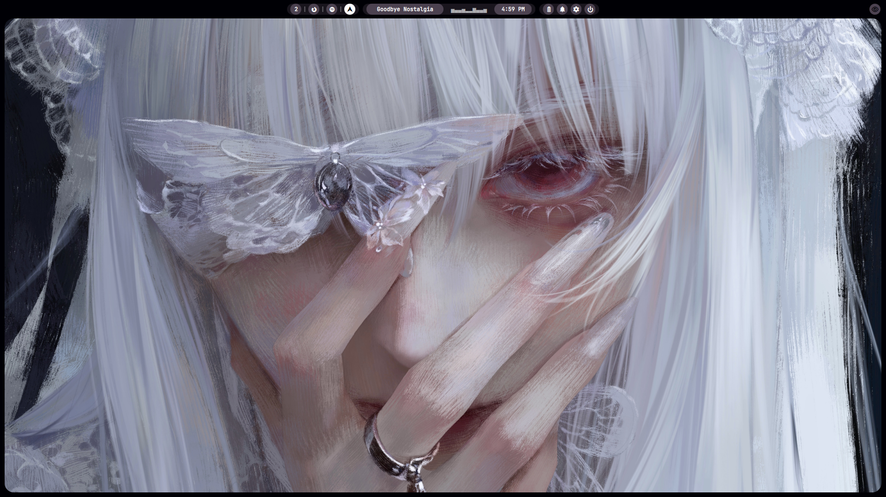
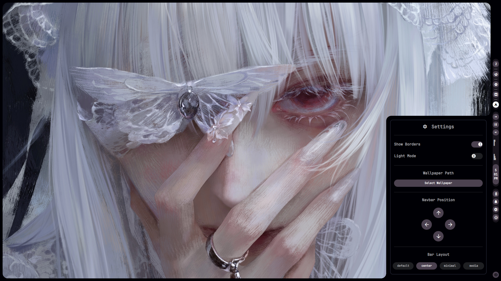
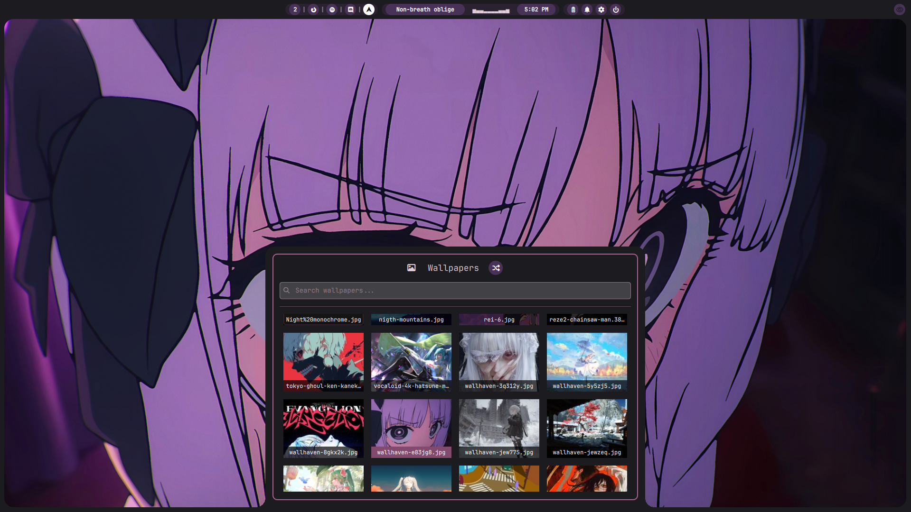

<div align="center">
 
# NeKoRoSHELL DLux (Shell)

    
 <br>
 <br>

</div>

The best way to say "I use Linux btw 🤓" is if your desktop environment looks sleek and suave.

Powered by Hyprland and Quickshell, **NeKoRoSHELL DLux** strives to achieve what its predecessor could not; all while maintaining core philosophies and robustness.

**This repo only contains the files for `.config/quickshell/`. If you want the actual dotfiles, [check them out here](https://github.io/NeKoRoSYS/NeKoRoSHELL-DLux-Shell)**

<br>

 
<br>
<br>
<br>
 
<br>
<br>
<br>
 
<br>
<br>

### Roadmap

NeKoRoSHELL DLux is currently being developed by two people (*cough* [CONTRIBUTING](https://github.com/NeKoRoSYS/NeKoRoSHELL-DLux-Shell/tree/main?tab=contributing-ov-file#) *cough*) and is constantly under rigorous quality assurance for improvement. We always aim to keep a "no-break" promise for every update so that you can safely update to later versions without expecting any breakages.

<br>
<div align="center">

| 📋 **TODO** | **STATUS** |
| :---: | :---: |
| Improve base theme | 🛠 |
| Replace swww | ✅ |
| Replace mpvpaper | ✅ |
| Replace waybar | ✅ |
| Replace rofi | ✅ |
| Replace wlogout | ✅ |
| Replace SwayNC | ✅ |
| Port all necessary bash scripts into native QML modules/functionality | ✅ |

</div>
<br>

## Hyprland

For a more aesthetic experience when using transparent mode, be sure to put these anywhere on your `hypr` config files:

```conf
layerrule = no_anim 1, match:class ^quickshell$
layerrule = blur 1, match:namespace ^quickshell-panel$
layerrule = ignore_alpha 0.1, match:namespace ^quickshell-panel$
layerrule = blur 1, match:namespace ^quickshell-navbar$
layerrule = ignore_alpha 0.1, match:namespace ^quickshell-navbar$
layerrule = blur 1, match:namespace ^quickshell-power$
layerrule = ignore_alpha 0.1, match:namespace ^quickshell-power
```

(Optional, you can configure keybinds however you want. Just know that you can toggle panels using `qs ipc call nekoroshell PANELid`)
```conf
bind = $mainMod, W, exec, qs ipc call nekoroshell toggle wallpaper
bind = $mainMod, D, exec, qs ipc call nekoroshell toggle dashboard
bind = $mainMod, T, exec, qs ipc call nekoroshell toggle tray
bind = $mainMod, V, exec, qs ipc call nekoroshell toggle clipboard
bind = $mainMod, N, exec, qs ipc call nekoroshell toggle notifications
bind = $mainMod, A, exec, qs ipc call nekoroshell toggle overview
bind = $mainMod, L, exec, qs ipc call nekoroshell toggle power
```
<br>

## Acknowledgements

- Amelie ([@S-e-r-a-p-h-i-n-e](https://github.com/S-e-r-a-p-h-i-n-e)) for revamping the project architecture! Your contributions made DLux more modular and easier to maintain.
  - Also try [YAQC](https://github.com/S-e-r-a-p-h-i-n-e/YAQC/tree/main), it's a fork of DLux! Both projects contain the same DNA but with different philosophies applied; parity is subjective and some functionalities are either altered or totally different but we often opt for doing soft merges every once in a while.
<br>

## Star History
<br>

<div align="center">
<a href="https://www.star-history.com/#nekorosys/NeKoRoSHELL-DLux-Shell&type=date&legend=bottom-right">
 <picture>
   <source media="(prefers-color-scheme: dark)" srcset="https://api.star-history.com/svg?repos=nekorosys/NeKoRoSHELL-DLux-Shell&type=date&theme=dark&legend=bottom-right" />
   <source media="(prefers-color-scheme: light)" srcset="https://api.star-history.com/svg?repos=nekorosys/NeKoRoSHELL-DLux-Shell&type=date&legend=bottom-right" />
   
 </picture>
</a>
</div>
